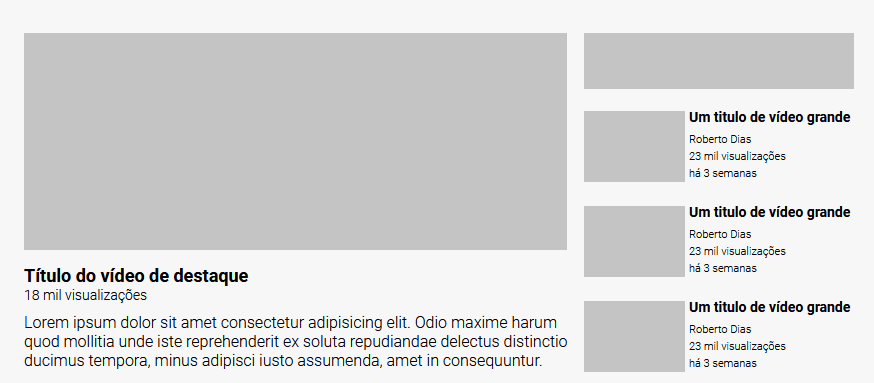

# Projeto Layout Youtube
Um projeto onde desenvolvi o layout do youtube usando o grid como base. 🚀🛸

[](https://omarcerqueira.github.io/layout-youtube-com-grid/)

## Tecnologias Utilizadas
- HTML
- CSS

## Como Utilizar
1 - Clone o repositório
```
git clone https://github.com/OmarCerqueira/layout-youtube-com-grid.git
```
2 - Acesse a pasta do projeto
```
cd exercicio-layout-youtube-com-grid
```


